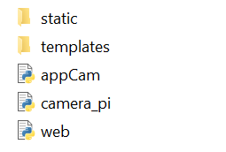

<br />
 <p align="center">
     
    <h1 align="center">The RaspiCar Project</h1>
    <p align="center" class="h6">By Eliana Lopez</p>
    <p align="center"></p>
 </p>
 
This project contains the full documentation and start to end process of modifying and RC car with a Raspberry Pi Model B+.

<!-- TABLE OF CONTENTS -->
## Table of Contents  
<!-- AUTO-GENERATED-CONTENT:START (TOC:collapse=true&collapseText="Click to expand") -->
<details>
<summary>click to expand</summary>
 
- [Tools Used](#Tools-Used)  
- [Setup](#Setup)  
- [After the setup](#After-the-setup)  
- [The Code](#The-Code)  
- [How to Run the Program](#How-to-Run-the-Program)  

</details>
<!-- AUTO-GENERATED-CONTENT:END -->

## Tools used
<ul>
<li>HyperChargers Remote Controlled Car</li>
<li>Raspberry Pi 3 Model B+</li>
<li>Raspberry Pi Camera V2.1</li>
<li>L298N Motor Drive Controller Board Module</li>
<li>Mophie USB Power Bank, 10,500mAh</li>
<li> Female/Female Jumper Wires</li> 
<li> Male/Female Jumper Wires</li>
</ul>

## Setup
This is the hardware setup of the Raspberry Pi RC car within the diagram below. If unable to see it for any reason you can  <a href="https://github.com/elianalopez/RaspiCar-Project/blob/main/Images/diagram.png?raw=true">view the diagram here!</a>


## After the Setup
Once you are finished setting up, I have added a folder named **TESTING** that has a Python file called *motorControl.py*. This file is created to see if your motors are connected correctly or referenced to the Raspberry Pi. 

If you need any more informatio regarding Raspberry Pi GPIO pins this <a href="https://projects.raspberrypi.org/en/projects/physical-computing/1">website contains more information.</a>

## The Code
Overall the layout of the code within your Raspberry Pi should look like this:



### Creating the live streaming server
The files camera_pi.py and appCam.py are created by Miguel Grinberg. 
* camera_pi.py is the direcotry camWebServer
* camApp.py is the webserver application

### Creating a flask micro web application framework

web.py is the file that utilizes the webserver and integers the Raspberry Pi GPIOs that are being used, along with our camera.

This is a simple example of a "Hello, World!" program in Flask

```python
from flask import Flask
app = Flask(__name__)

@app.route("/")
    def hello():
        return "Hello, World!"

if __name__ == "__main__":
    app.run()
```

### Static and Templates 
The folders static and templates are the HTML and CSS of our web application. It just helps design and format our Web User Interface when controlling the modified RC Car in Raspberry Pi

## How to Run the Program
Turn on the Raspberry Pi via normally or SSH network (for a truly wireless experience)
<br>
For SSH network I use VNC viewer and put the IP address of the Raspberry Pi in order to conect to with with my laptop. 

I have left these resources down below if needed:
* <a href="https://www.raspberrypi.org/documentation/remote-access/ip-address.md">How to find the Raspberry Pi IP address</a>
* <a href="https://www.realvnc.com/en/connect/download/viewer/"> Download VNC Viewer </a>

#### Raspberry Pi Terminal input
Raspberry Pi Terminal input:
<br>
 `sudo python3 web.py`
 <br>
 Got to http://0.0.0.0:5000/ in your browser to enter the motor controller user interface

  
## Car in Action
To view the car in action click <a href="https://github.com/elianalopez/Raspberry-Pi-RC-Car-Project/blob/master/car.mov?raw=true">here</a>
<br>
This link will download the video of my car running
